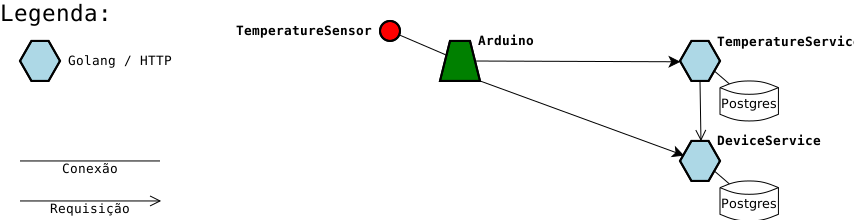

# :robot: jarvis

## Services

### DeviceService

 - Objetivo: Permitir conexão de aparelhos remotos (Sensores, computadores, etc...)
 - Linguagem: Golang 1.12
 - Framework: Gin Web Framework / HTTP